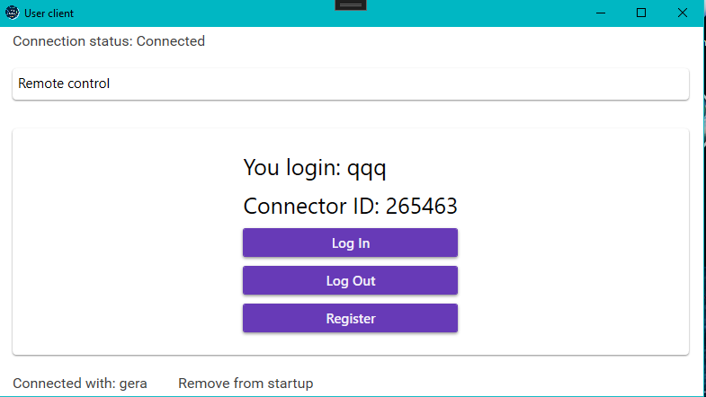
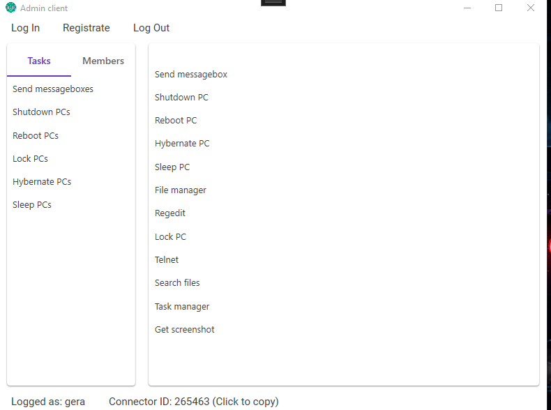
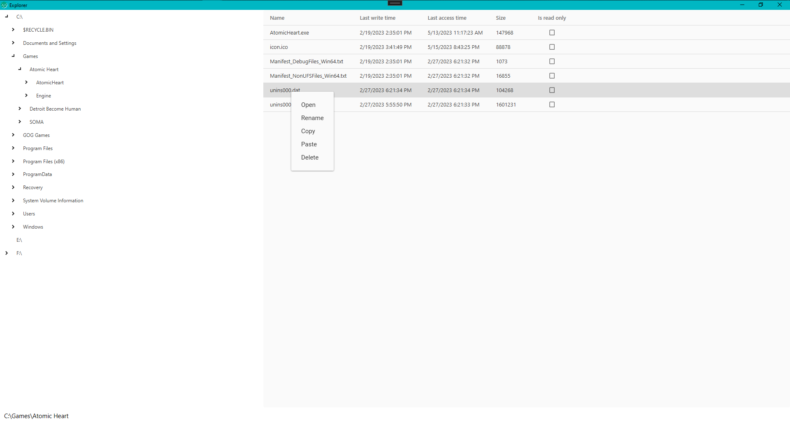
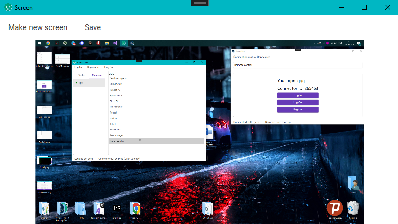
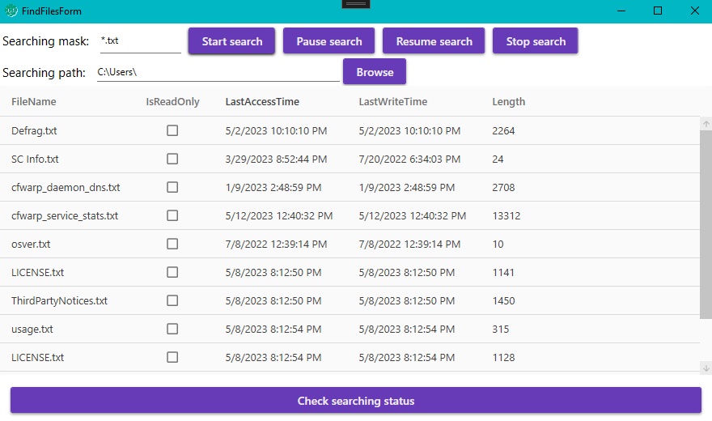
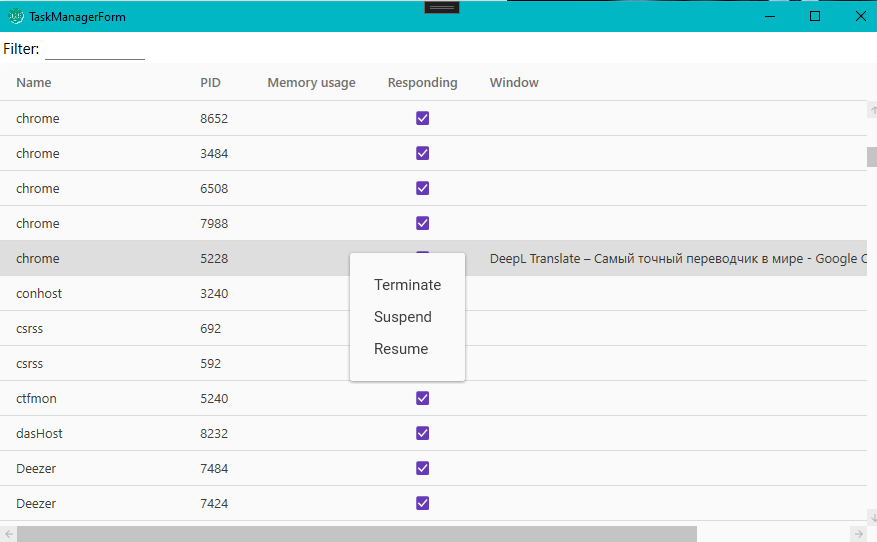
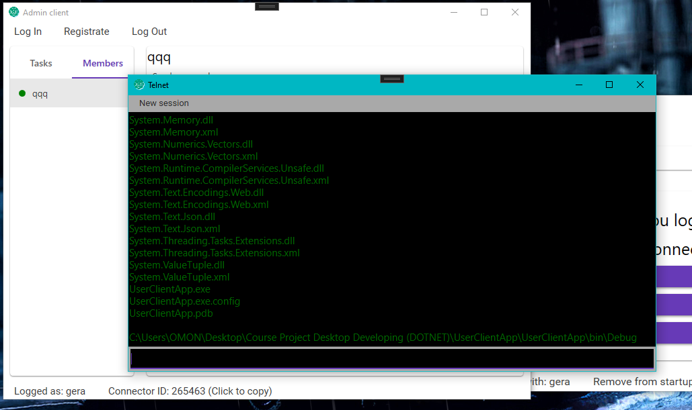

<br />
<div align="center">
  

  <h3 align="center">Collective</h3>

  <p align="center">
    <a href="https://github.com/EmcTROJ1N/CollectiveRAdmin/">View Demo</a>
    ·
    <a href="https://github.com/EmcTROJ1N/CollectiveRAdmin/issues">Report Bug</a>
    ·
    <a href="https://github.com/EmcTROJ1N/CollectiveRAdmin/issues">Request Feature</a>
  </p>
</div>


<!-- TABLE OF CONTENTS -->
<details>
  <summary>Table of Contents</summary>
  <ol>
    <li>
      <a href="#about-the-project">About The Project</a>
      <ul>
        <li><a href="#built-with">Built With</a></li>
      </ul>
    </li>
    <li>
      <a href="#getting-started">Getting Started</a>
      <ul>
        <li><a href="#prerequisites">Prerequisites</a></li>
        <li><a href="#installation">Installation</a></li>
      </ul>
    </li>
    <li><a href="#usage">Usage</a></li>
    <li><a href="#contributing">Contributing</a></li>
    <li><a href="#contact">Contact</a></li>
    <li><a href="#acknowledgments">Acknowledgments</a></li>
  </ol>
</details>


<!-- ABOUT THE PROJECT -->
## About The Project

The Collective project is an application built on the Windows Presentation Foundation (WPF) and Windows Communication Foundation (WCF) platform. This application is similar to the well-known Radmin application, providing the ability to remotely access and manage computers.

The main goal of the Collective project is to develop a functional, open-source, free and easy-to-use remote computer access and management application. Users will be able to easily connect to remote computers, browse the desktop, work with the file system and perform various operations remotely.
Below is a list of the main features in the program
* Send a pop-up window to the user
* Turn off PC
* Restart PC
* Send PC to hibernate
* Send PC to sleep
* File manager
* Registry
* Lock the PC
* File search
* Task Manager
* Capture screenshot

<p align="right">(<a href="#readme-top">back to top</a>)</p>


### Built With

The creation of the project involved:

| Technology                                                                                                            |
| ----------------------------------------------------------------------------------------------------------------------|
|        |
|                                 |
|  |
<p align="right">(<a href="#readme-top">back to top</a>)</p>


<!-- GETTING STARTED -->
## Getting Started

For this project to work, you need to meet some requirements:

<ol>
  <li>Windows operating system</li>
  <li>DirectX</li>
  <li>.net framework (not .net core)</li>
  <li>Visual Studio (JetBrains Rider or other IDE)</li>
</ol>

<!-- ### Prerequisites

This is an example of how to list things you need to use the software and how to install them.
* npm
  ```sh
  npm install npm@latest -g
  ``` 
No special steps are necessary
-->

### Installation

Clone the repo
   ```sh
   git clone https://github.com/EmcTROJ1N/CollectiveRAdmin
   ```
While trying to start the project in this state an error may occur indicating that one of the packages is damaged, in this case it is recommended to run
```
dotnet restore
```
If that does not help, reinstall the MaterialDesignThemes package. To do that you have to go to the Nuget package manager.

<p align="right">(<a href="#readme-top">back to top</a>)</p>

## Work Examples:

### User client app main window



### Admin client app main window



### Explorer



### Regedit


### Screenshot grabber



### Search files



### Task manager



### Telnet



<p align="right">(<a href="#readme-top">back to top</a>)</p>


<!-- CONTRIBUTING -->
## Contributing

Contributions are what make the open source community such an amazing place to learn, inspire, and create.

If you have a suggestion that would make this better, please fork the repo and create a pull request. You can also simply open an issue with the tag "enhancement".
Don't forget to give the project a star! Thanks again!

<ol>
  <li>Fork the Project</li>
  <li>Commit your Changes (`git commit -m 'Add some AmazingFeature'`)</li>
  <li>Push to the Branch (`git push origin feature/AmazingFeature`)</li>
  <li>Open a Pull Request</li>
</ol>

<p align="right">(<a href="#readme-top">back to top</a>)</p>


<!-- CONTACT -->
## Contact

Your Name - [@emctroj1n](https://t.me/EmcTROJ1N) - 19et72@mail.ru

[Project Link](https://github.com/EmcTROJ1N/WPFChess)

<p align="right">(<a href="#readme-top">back to top</a>)</p>


<!-- ACKNOWLEDGMENTS -->
## Acknowledgments

Use this space to list resources you find helpful and would like to give credit to. I've included a few of my favorites to kick things off!

* [Cake.powershell](https://github.com/SharpeRAD/Cake.Powershell)
* [NotifyIcon](https://github.com/hardcodet/wpf-notifyicon)
* [Material design](https://github.com/MaterialDesignInXAML/MaterialDesignInXamlToolkit)

<p align="right">(<a href="#readme-top">back to top</a>)</p>
